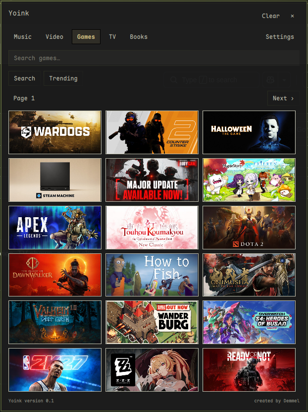
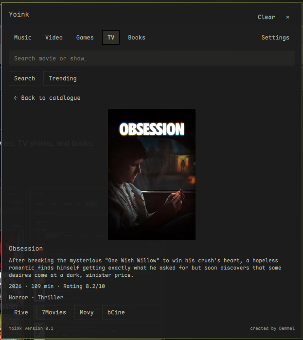
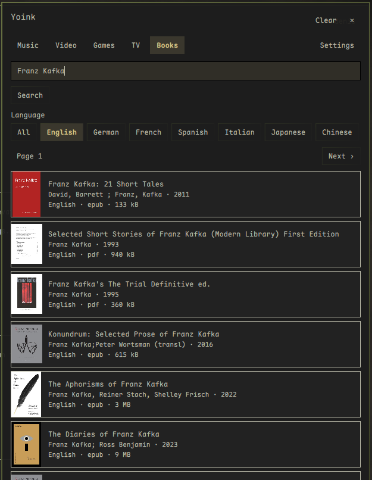

# Yoink!

:pirate_flag: A small Omarchy bar plugin for downloading media and browsing games, movies,
TV shows, and books.

## Screenshots

<p align="center">
  
  
  
</p>

## Install

```sh
omarchy pkg add streamrip python-ytmusicapi yt-dlp ffmpeg
git clone https://github.com/mxKeaton/yoink.git
cd yoink
bash install.sh
```

## What's Included

- Downloads music from various different sources!
- Spotify and YT Playlist downloads!
- YT video downlaods!
- Games catalogue with store and source links!
- Movie and TV show catalogue with streaming source links!
- Book and article downloads!
